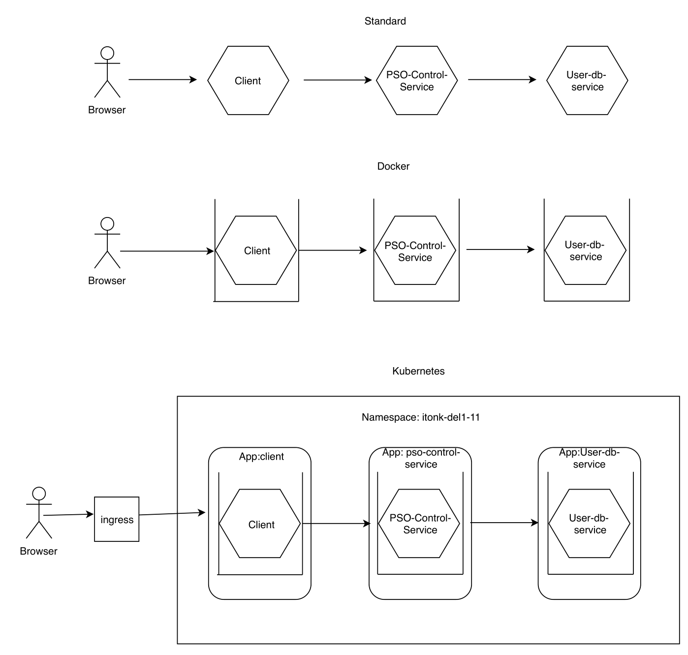

# ITONK-11

TSEIS - The Stock Exchange Interaction System - [LINK to site]

## Description

TSEIS is a stock broking platform, where brokers can buy and sell shares. The shares will be subject to Tobin Tax (1%). Brokers will have an account, where they can gain an overview, where they can manage their portfolio.

The system will automatically listen to events and notify users of the new information.

### Use cases

- As a "Tobin Taxer" I want to tax all transaction with a charge af 1%  of the total transaction value for then to be able to send the tax to the state.
- As a "Public Share Own Control" I want to be informed of any changes in the share ownerships  for then to be able to track who is the owner of any share and series of shares.
- As a "Stock Trader Broker" I want to be the broker between the seller (provider) og the buyer (requester) for then to be able to intermediate the  trade of one or more  shares or one or more series of shares between one or more provideres and/or one or more requesters.
- As a "Stock Trader Broker", "Stock Share Provider" or a "Stock Share Requester", I want to inform the Tobin Tax Control, that a transaction of a certain value has been commited, for then to be able obey the public rules about taxing and paying the 1% Tobin Tax.
- As a "Stock Trader Broker", "Stock Share Provider" or a "Stock Share Requester", I want to inform the The Public Share Owner Control, that a share, many shares or a series of shares or many series of shares has changed ownership, for then to able to inform the public about who own the shares.

### To Use

goto: 35.244.217.135 for ingress (it might fail, it has been pretty unstable lately)

LoadBalancer for services:
- client (frontend): 35.198.171.9
- pso-control-service (backend): 35.246.254.34
  - api/users
  - api/sharemodels

### Services

- client: frontend
- pso-control-service: backend api server
- users-db: backend users-db for storage, currently contains both users and shares. These should be two seperate services (TODO).

